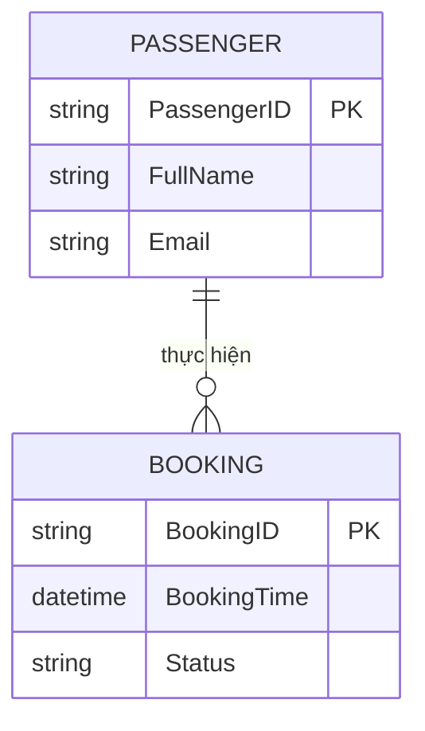

# Quy tắc vẽ Conceptual ERD

Tham khảo theo chuẩn vẽ Mô hình dữ liệu khái niệm (Conceptual ERD) cho tài liệu thiết kế.

## Mục đích

Ở bước thiết kế khái niệm, mục tiêu là thiết kế **mức khái niệm (conceptual)**, chỉ tập trung vào các khái niệm nghiệp vụ, chưa cần quan tâm đến kiểu dữ liệu vật lý (như VARCHAR, INT) hay khóa ngoại (Foreign Key columns).

## Các thành phần chính

### 1. Entity (Thực thể)
- Vẽ bằng hình chữ nhật
- Tên viết **CHỮ HOA** với underscore (ví dụ: `HO_SO_TUYEN_SINH`, `SINH_VIEN`)

### 2. Attribute (Thuộc tính)
- Liệt kê bên trong thực thể
- Khóa chính (PK) phải được **gạch chân** và xác định duy nhất từng bản ghi
- Trong drawio dùng: `<b><u>tenThuocTinh</u></b> : kiểu`

### 3. Relationship (Quan hệ) & Cardinality (Bản số)
Sử dụng ký hiệu chân chim (Crow's foot notation):

| Ký hiệu | Ý nghĩa |
|---------|---------|
| `\|\|` | Đúng một (exactly one) |
| `o\|` | Không hoặc một (zero or one) |
| `\|{` | Một hoặc nhiều (one or many) |
| `o{` | Không hoặc nhiều (zero or many) |

## Quy trình 5 bước vẽ Conceptual ERD

### Bước 1: Xác định thực thể (Entities)

Đọc lại Use Case (DOC 2.1-B) và Sơ đồ quy trình (DOC 2.2-A), gạch dưới các **danh từ** chỉ đối tượng mà hệ thống cần lưu trữ thông tin.

Phân loại thực thể thành 3 nhóm:

| Loại | Mô tả | Ví dụ |
|------|-------|-------|
| **Core entity** | Đối tượng trung tâm của nghiệp vụ | HO_SO_TUYEN_SINH, SINH_VIEN |
| **Reference entity** | Danh mục cố định, ít thay đổi | NAM_TUYEN_SINH, NGANH_DANG_KY |
| **Supporting entity** | Hỗ trợ, đính kèm | TEP_DINH_KEM |
| **Associative entity** | Bảng trung gian giải quyết M:N | BOOKING_SEAT |

### Bước 2: Xác định thuộc tính (Attributes)

- Mỗi thực thể **BẮT BUỘC phải có 1 Primary Key**
- Thêm 3-5 thuộc tính mô tả quan trọng nhất
- Chỉ ghi kiểu dữ liệu chung chung: *text, number, datetime, boolean*
- **KHÔNG ghi Khóa ngoại (FK)** vào đây vì quan hệ đã được thể hiện bằng đường nối

### Bước 3 & 4: Quan hệ và Bản số

Xác định cách các thực thể liên kết với nhau theo nghiệp vụ: 1:1, 1:N, hoặc M:N.

**QUY TẮC BẮT BUỘC**: Mọi quan hệ M:N **phải được phân rã thành hai quan hệ 1:N** thông qua một Associative Entity.

Ví dụ: Một BOOKING có thể đặt nhiều SEAT, một SEAT thuộc nhiều BOOKING → Tạo bảng trung gian BOOKING_SEAT.

### Bước 5: Sắp xếp và hoàn thiện

- Đặt thực thể chính/cha ở trên hoặc bên trái
- Thực thể phụ/con ở dưới hoặc bên phải
- Thực thể trung gian ở giữa
- Kiểm tra logic: có thực thể nào mồ côi không? Cardinality đã đúng nghiệp vụ chưa?

## Cú pháp drawio cho Crow's Foot

### Edge style cho 1:N (||--o{)

```
edgeStyle=entityRelationEdgeStyle;
fontSize=11;
html=1;
endArrow=ERmany;endFill=0;
startArrow=ERmandOne;startFill=0;
rounded=0;
strokeColor=#333333;
strokeWidth=1.5;
```

### Edge style cho 0..1 to N (o|--o{)

```
startArrow=ERzeroToOne;startFill=0;
endArrow=ERmany;endFill=0;
```

## Mermaid syntax (cho file .md preview)



## Ví dụ ERD đầy đủ (project Quản lý Tuyển sinh)

7 thực thể nghiệp vụ:
- **Core**: SINH_VIEN, HO_SO_TUYEN_SINH
- **Reference**: NAM_TUYEN_SINH, DOT_TUYEN_SINH, NGANH_DANG_KY, HE_DAO_TAO
- **Supporting**: TEP_DINH_KEM

7 quan hệ 1:N (không có M:N):
- SINH_VIEN ||--o{ HO_SO_TUYEN_SINH : "nộp"
- NAM_TUYEN_SINH ||--o{ DOT_TUYEN_SINH : "chứa"
- NAM_TUYEN_SINH ||--o{ HO_SO_TUYEN_SINH
- DOT_TUYEN_SINH ||--o{ HO_SO_TUYEN_SINH
- NGANH_DANG_KY ||--o{ HO_SO_TUYEN_SINH
- HE_DAO_TAO ||--o{ HO_SO_TUYEN_SINH
- HO_SO_TUYEN_SINH ||--o{ TEP_DINH_KEM

## Lưu ý quan trọng

- Conceptual ERD KHÔNG bao gồm các bảng infrastructure như TaiKhoan, RefreshToken, LichSuCapNhat (audit log) — chỉ bao gồm thực thể nghiệp vụ
- Physical ERD (mục 5.3) mới là nơi đầy đủ tất cả bảng với data types và FK columns
- Nếu nghiệp vụ không có quan hệ M:N → KHÔNG cần associative entity
